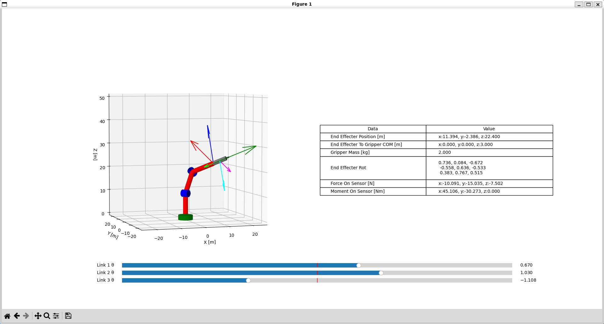

# robot-gravity-compensation

このパッケージは、ロボットの重力補償の計算を行うサンプルを提供します。
エンドエフェクタに力覚センサと，その先にグリッパを取り付けたロボットを想定しています。

静力学的に計算を行い，センサにかかる力とモーメントを計算します。
これによって，グリッパの重力保障を行うときに，センサにかかる力・モーメントを計算することができます。

ロボットはDH法で記述されており、コンストラクタにDHパラメータを与えることで、様々なロボットに対応できます。

# License

MIT License 
[LICENSE](LICENSE)を参照してください。
